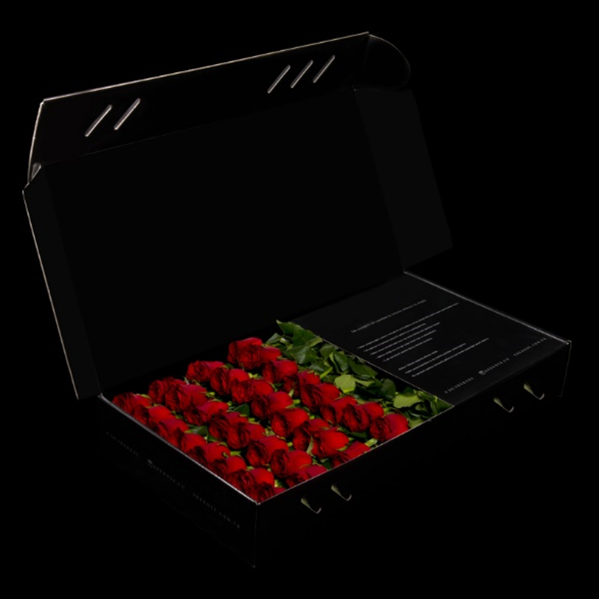
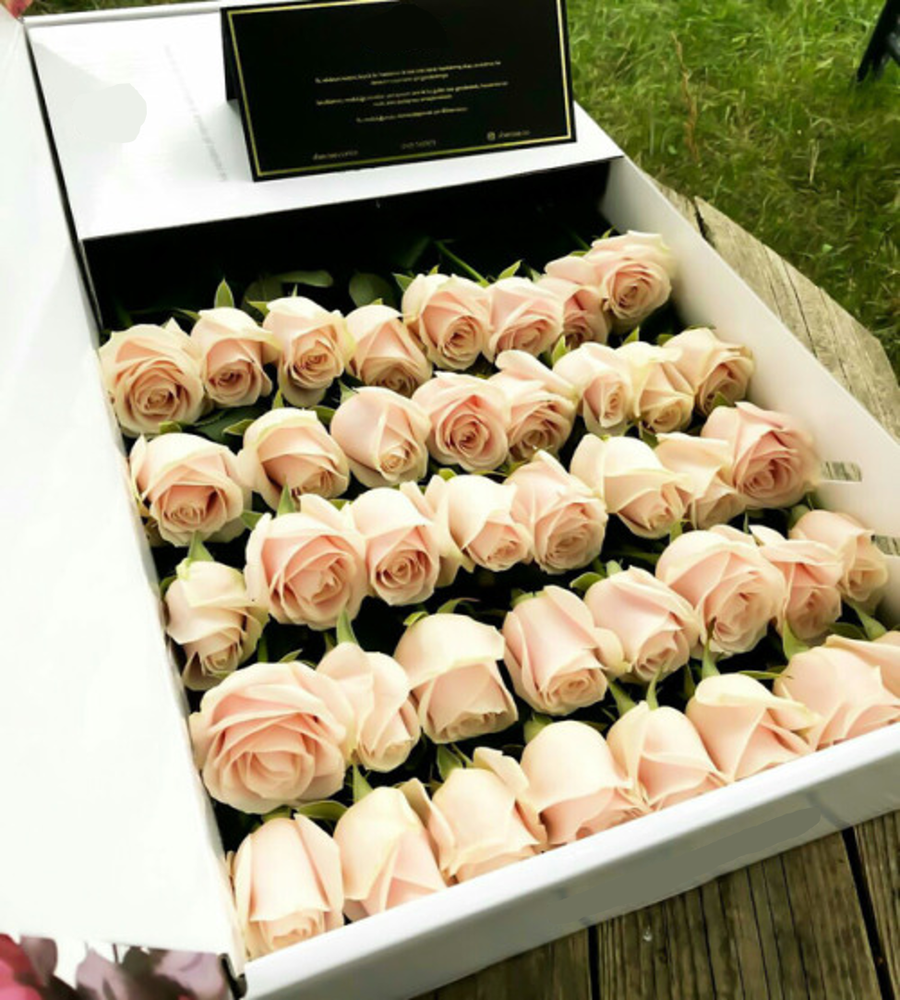

# Roses

Rose is an ecommerce app specialized in spreading love and romance where we will charm you with the most lovely Roses bouquet presentation to show your feelings to your loved one.

We offer you the best quality roses, that you can send in any date you want to any place in amman.

## Our Vision:

Spreading love is our vision, No matter how far the distance between you and your loved one you can always send them a luxurious customized bouquet of roses to express your feelings.

## Pain Points we will solve

1) Break Distances between loved ones, no matters where are you located, you can always show love and send roses easily.

2) Choose the delivery date and we will take care of the rest.

3) You are so busy that you might forgot the important memories dates ? save the dates on your profile and we will remind you to send a unique roses bouquet to your loved one.

4) Do you love her/him as big as the universe? customize your roses box with a picture of the  (universe) pictured on that specific date. 

"Note that the pictures are real taken from nasa API".

5) Looking for luxurious bouquet of high quality roses ? our  team that combines innovative and modern lines with a minimalist design approach, putting creativity and nobility in front of everything is here to serve you

## Why should you care about the product?

As it said *" a Rose speaks love silently in a language known only to the heart "*.

So we work hard to design our lovely Roses branded bouquet to be customized for you to show your true feelings to your loved one.

## Our Products

Rose is specialized in roses and in spreading love.

### Rose Bouquets

The User Can choose between 3 different Bouquet Designs as shown in the pictures below.

**The Black Box**

**The White Box**

**The Turquoise Box**

## Bouquet Sizes

Our bouquets comes in three different sizes:

1) A bouquet of 5 rows of perfectly aligned roses. Each row has 8-9 roses, depending on their size, and they are arranged in the box in a total of 45-50 roses.

2) A bouquet of 6 rows of perfectly aligned roses. Each row has 8-9 red roses, depending on their size, and they are arranged in the box in a total of 50-55 roses.

3) A bouquet of 7 rows of perfectly aligned roses. Each row has 8-9 red roses, depending on their size, and they are arranged in the box in a total of 55-60 roses.

### Roses Colors

The user can choose between 6 different rose colors.

**Red Roses**

**White Roses**

**Pink Rose**

## Table Of Content

number | Content| Read link
------------ | ------------- | --------------
01 |  About the Product| [Click here](https://oebitw.github.io/flowers/articles/requirements)
02 |  Competitors Analysis| [Click here](https://oebitw.github.io/flowers/articles/competitors)
03 | Wire frames| [Click here]()
04 | Business process flows| [Click here]()
05 | For Developers| [Click here]()
