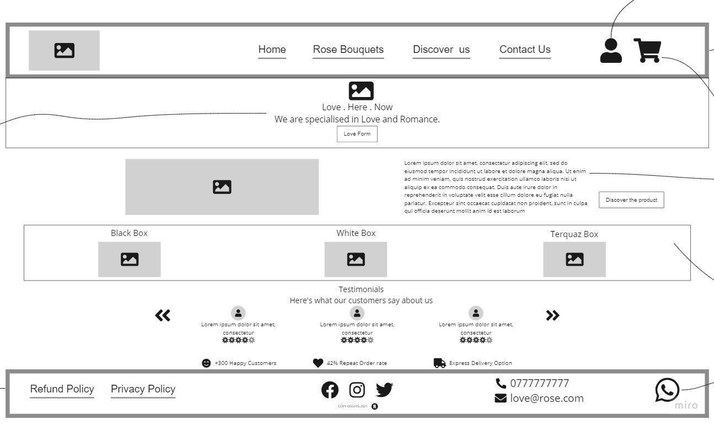

# Rose System Overview

## Business Requirements
Our application will power an online storefront that will allow our users to browse our product offerings by category, place items in their shopping cart, and check-out when they are ready to make their purchase.

## The core requirements and functionality

### Header

- The header should present the application title and main menu.

All Pages will have the same Header in Order to have consistent Design through our web app.

### Home Page

- Dynamic Hero Image will be background for the navbar too. with a text will appear as index 1 above the hero image and it will change as the Hero image changes (the changing texts will show our main values and vision).
There will be a call to action button for the user to courage him to order.

Note: In order to have a contestant
Design, all the static pages will have this element.

- A brief educational section where user will be educated briefly about the product with a button to redirect user to discover us page.

- categories section display cards of our product categories, when the user hover on any Bouquet, animated Call to action button will appear to redirect the user to the product page.

- Testimonial section shows previous buyers comments to build trust with the user.
 

### Shopping Cart

Shopping cart (simple version) always visible on screen.

### Account Icon

This is a shadow button to test if the users are interested in creating an account.

When the user clicks on it a  greeting and thanking message will appear to him/her for their interest in creating an account. and stating that the feature will launched soon.

### Rose Bouquets 

shows products with the ability to filter products by categories, Rose colors and Bouquet sizes.
 
Add the product to the shopping cart.

### Discover Us 

which will increase user awareness about our products.
 
### Contact Us

which shows our social media pages, phone numbers, and other communication channels.

### Checkout

Full shopping cart and check out screen available from main navigation.

Online Payment option

## Technical Requirements

The application will be created with the following overall architecture and methodologies.

1) React

2) ES6 Classes

3) Redux Store for Application State

4) Deployed API with Mongo storage for storing categories and products.

5) Superagent or Axios for performing API Requests

6) Material UI for layout and styling.

7) Test Driven Development, using Jest.

8) Deployment to a cloud provider.