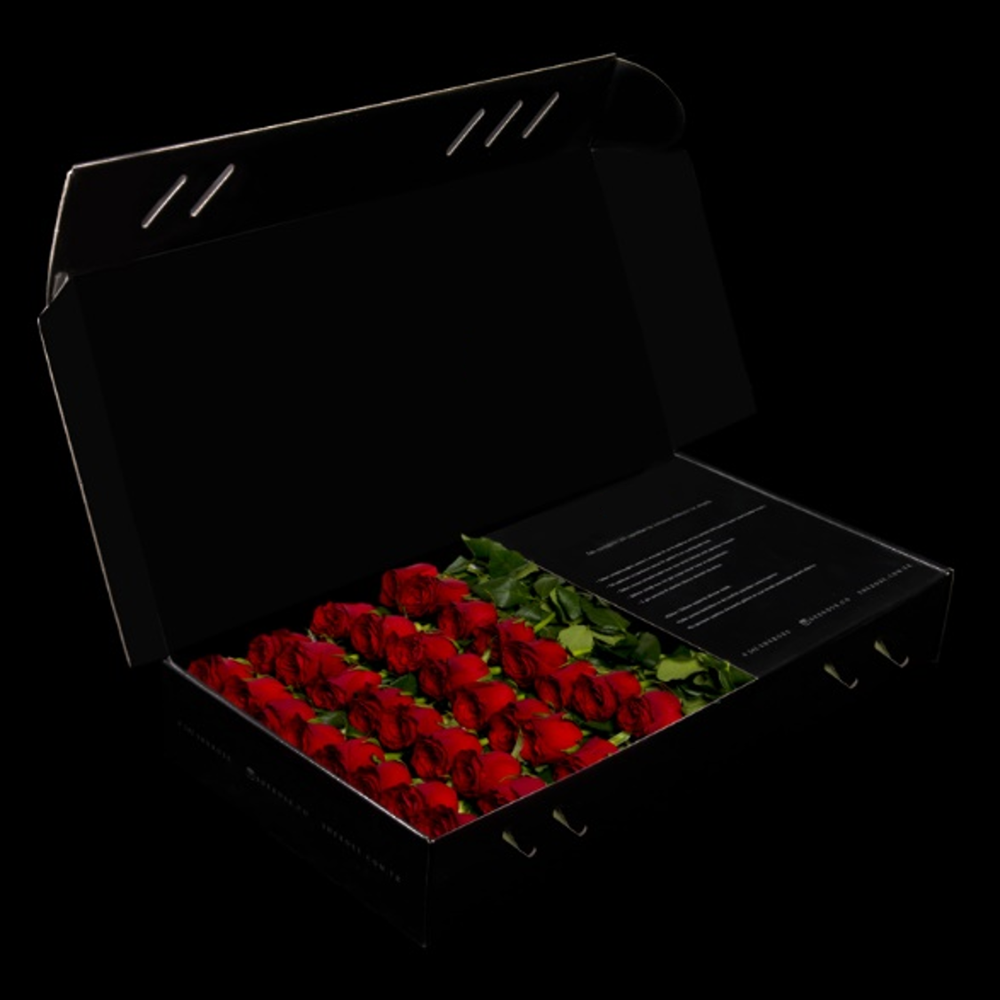
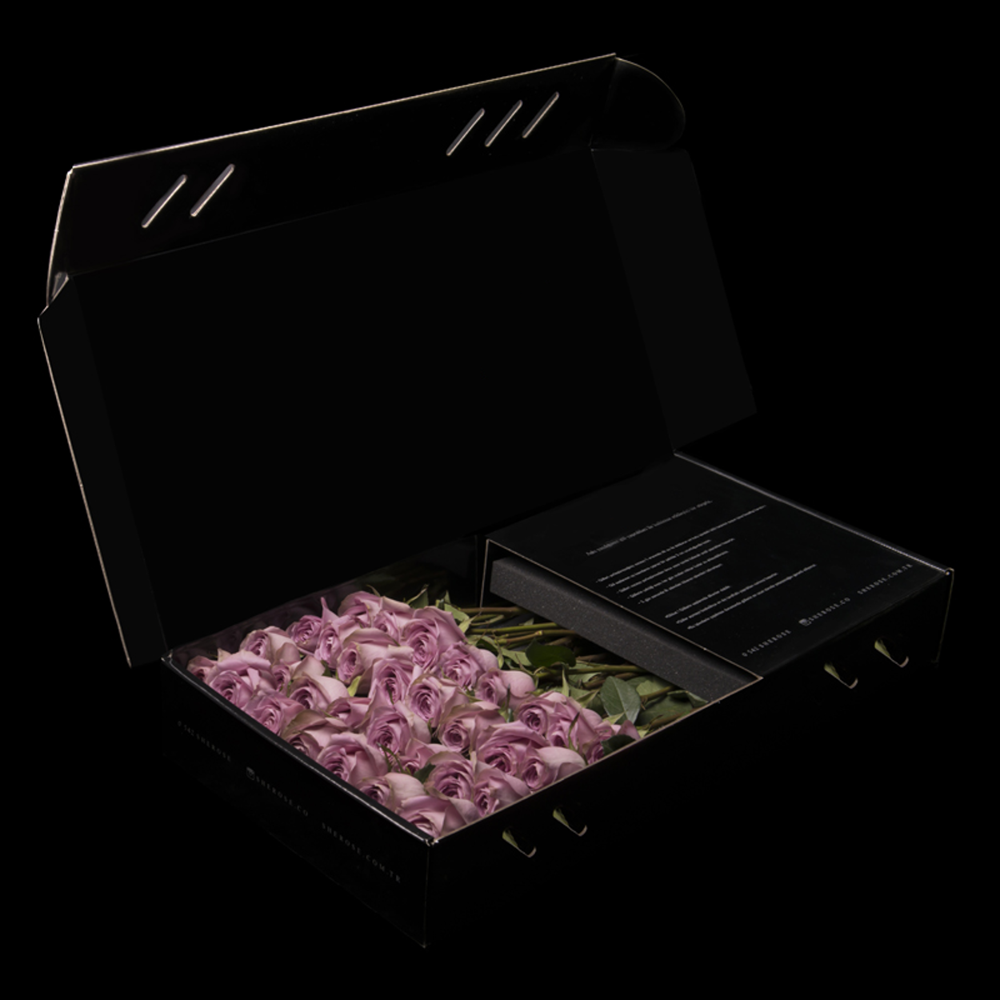
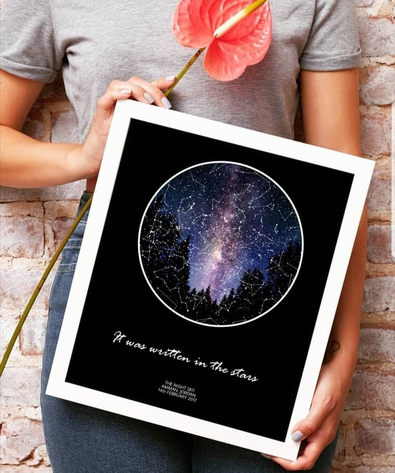
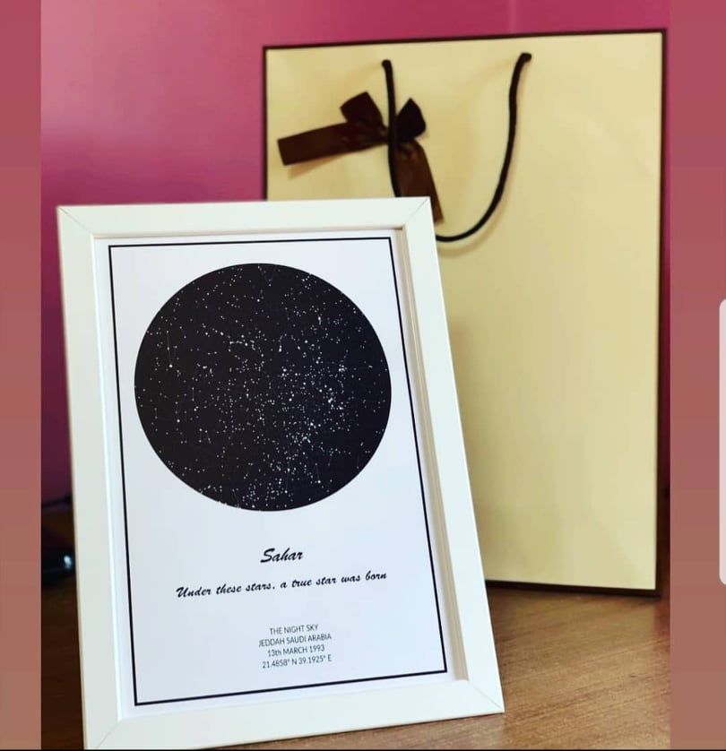

# Roses

Rose is an ecommerce app specialized in spreading love and romance where we will charm you with the most lovely Roses bouquet presentation to show your feelings to your loved one.

We offer you the best quality roses, that you can send in any date you want to any place in amman.

## Our Vision:

Spreading love is our vision, No matter how far the distance between you and your loved one you can always send them a luxurious customized bouquet of roses to express your feelings.

## Pain Points we will solve

1) Break Distances between loved ones, no matters where are you located, you can always show love and send roses easily.

2) Choose the delivery date and we will take care of the rest.

3) You are so busy that you might forgot the important memories dates ? Fill our *love form* and we will remind you couple days before the date to send a unique roses bouquet to your loved one. (the business goal here is to collect data about our potential customers)

4) Do you love her/him as big as the universe? customize your roses box with a picture of the  (universe) pictured on that specific date.

"Note that the pictures are real taken from NASA API".

5) Looking for luxurious bouquet of high quality roses ? our  team that combines innovative and modern lines with a minimalist design approach, putting creativity and nobility in front of everything is here to serve you

## Why should you care about the product?

As it said *" a Rose speaks love silently in a language known only to the heart "*.

So we work hard to design our lovely Roses branded bouquet to be customized for you to show your true feelings to your loved one.

## Our Products

Rose is specialized in roses and in spreading love.

### Rose Bouquets

The User Can choose between 3 different Bouquet Designs as shown in the pictures below.

**The Black Box**

**The White Box**

**The Turquoise Box**

## Bouquet Sizes

Our bouquets comes in three different sizes:

1) A bouquet of 5 rows of perfectly aligned roses. Each row has 8-9 roses, depending on their size, and they are arranged in the box in a total of 45-50 roses.

2) A bouquet of 6 rows of perfectly aligned roses. Each row has 8-9 red roses, depending on their size, and they are arranged in the box in a total of 50-55 roses.

3) A bouquet of 7 rows of perfectly aligned roses. Each row has 8-9 red roses, depending on their size, and they are arranged in the box in a total of 55-60 roses.

### Roses Colors

The user can choose between five different rose colors.

**Red Roses**

**White Roses**

**Pink Rose**

**Purple Roses**

**Orange Roses**

### You love her/him as big as the universe ? send your beloved one a picture for the universe pictured in your anniversary date by NASA

The user has the choice to select a specific date and we will customize the box with a frame for a picture taken on that date for the universe.

**Example**:

Let's assume a user entered 10th.april.2021 as it's memory or anniversary date, we will show him the following outputs :

1) A Picture for the sky on that specific day taken by NASA

2) Explanation about the Picture: (It's optional the user have the choice to print this explanation on the back of the picture)

An intense band of zodiacal light is captured in this serene mountain and night skyscape from April 7. The panoramic view was recorded after three hours of hiking from a vantage looking west after sunset across the Pyrenees in southern France. At 2838 meters altitude, Mont Valier is the tallest peak near center. In the sky above, the familiar stars of Orion and the northern winter Milky Way are approaching the rugged western horizon. At the shoulder of Orion, Betelgeuse is one of three bright yellowish celestial beacons. It forms a triangle with fellow red giant star Aldebaran located below Betelgeuse and to the right, and the red planet Mars. Mars shines just under the band of the Milky Way, still immersed in the bright zodiacal light.   Tournament Earth: Vote for your favorite image from NASA's Earth Observatory.

Moreover the User have an option to write any love quotes or letters, to be provided in the package.

Note that the picture will be reserved in a simple frame that has its own space in our box.

**Example**  : (Note that the frame size will be A5 , Smaller than the frame in the pictures)

